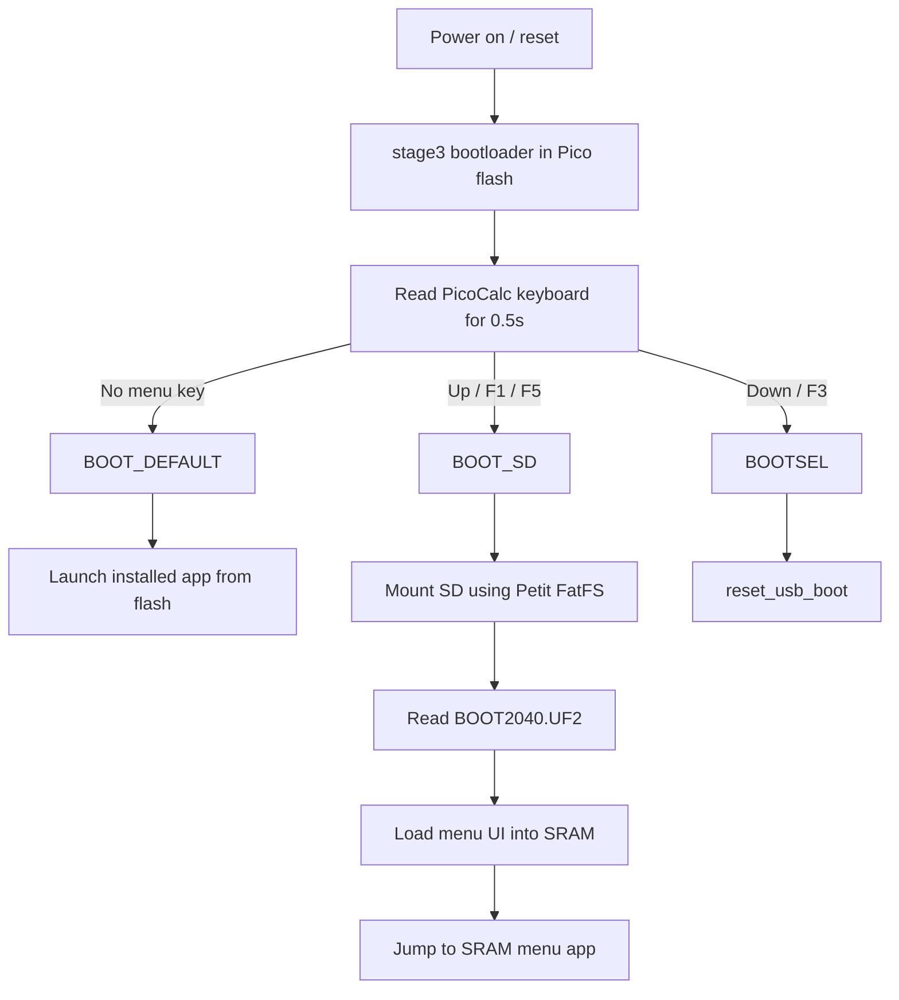
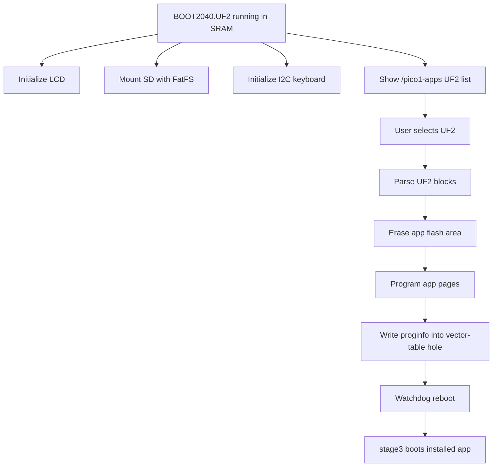

# PicoCalc UF2 Loader — Two-Stage Bootloader Deep Dive

This note explains how the `pelrun/uf2loader` bootloader for the ClockworkPi PicoCalc works, how to compile it, how to install it, why it is different from the stock PicoCalc Bootloader v1.0, and why it solves the uLisp SD-card boot problem better than the legacy `/firmware/*.bin` workflow.

> [!summary]
> - The old stock PicoCalc Bootloader v1.0 loads specially linked `.bin` files from `/firmware`; ordinary UF2-to-BIN conversion is not enough.
> - `uf2loader` uses a two-step design: a tiny flashed bootloader in Pico flash plus a menu UI loaded from `BOOT2040.UF2` or `BOOT2350.UF2` on the SD card.
> - Once installed, normal Arduino/Pico `.uf2` applications can live in `/pico1-apps/` for RP2040 or `/pico2-apps/` for RP2350 and be selected from a menu on the PicoCalc display.
> - The menu is not embedded in the small flashed bootloader; it is itself a UF2 program loaded from SD into RAM.

## Why this note exists

We were trying to boot uLisp from the PicoCalc SD card. The early attempts produced `.uf2` and `.bin` files successfully, copied them to `/Volumes/NO NAME/firmware`, and saw the files appear in the stock bootloader menu. The failure was not in copying files or compiling uLisp. The failure was the binary format expected by the stock bootloader.

The stock bootloader does not accept normal UF2 files. It also does not accept a normal UF2 payload extracted into a `.bin`. It expects a `.bin` image that is linked for the bootloader's application offset and begins with an RP2040 vector table. The generated uLisp `.bin` files began with the RP2040 second-stage bootloader bytes, not a vector table. Known-good stock bootloader `.bin` files began with a stack pointer and reset vector.

`uf2loader` changes the workflow. Instead of requiring every app to be linked specially, it reads ordinary UF2 files, flashes them into the application area, and preserves a tiny high-flash bootloader region so the loader can still be reached later.

## Current project status

The repository is:

```text
/home/manuel/code/wesen/2026-05-05--ulisp-picocalc
```

Relevant local artifacts:

```text
uf2loader/                                             # pelrun/uf2loader submodule pinned to v2.4.1
PicoCalc/Code/pico_multi_booter/                       # ClockworkPi legacy multibooter source
downloads/uf2loader-v2.4.1/BOOT2040.uf2               # official menu UI file
downloads/uf2loader-v2.4.1/bootloader_pico.uf2        # official RP2040 bootloader file
downloads/uf2loader-v2.4.1/diag_pico.uf2              # official diagnostic file
ttmp/2026/05/05/picocalc-wm--replace-picocalc-console-with-window-manager/
```

The SD card was prepared with both Pico 1 and Pico 2W assets, using separate app folders and explicit names so the two board targets cannot overwrite one another:

```text
/BOOT2040.UF2
/BOOT2350.UF2
/pico1-apps/uLisp_4.8f_arduino_pico_4.5.0.uf2
/pico2-apps/uLisp_4.8f_pico2w_arduino-pico-4.5.0.uf2
/firmware/uf2loader_bootloader_pico_v2.4.1.uf2
/firmware/uf2loader_diag_pico_v2.4.1.uf2
/firmware/uf2loader_bootloader_pico2_v2.4.1.uf2
/firmware/uf2loader_diag_pico2_v2.4.1.uf2
```

The files in `/firmware` are convenience copies. They are not how the new bootloader is installed. The bootloader itself must be flashed to the Pico or Pico 2W via BOOTSEL or picotool. The SD-root `BOOT2040.UF2` and `BOOT2350.UF2` files are the menu UI programs loaded by the already-flashed bootloader.

## The two bootloader families

There are two distinct bootloader workflows for PicoCalc.

### Stock ClockworkPi Bootloader v1.0 / legacy multibooter

The stock bootloader shows firmware files under:

```text
/firmware/*.bin
```

It copies the selected `.bin` into flash at a fixed offset:

```c
#define SD_BOOT_FLASH_OFFSET (200 * 1024)
```

The relevant code path in `PicoCalc/Code/pico_multi_booter/sd_boot/main.c` opens a selected file, checks its size, compares it against the currently flashed app, erases flash sectors starting at `SD_BOOT_FLASH_OFFSET`, programs file bytes into that range, then validates the installed program by reading the vector table at the app location.

The validation test is:

```c
static bool is_valid_application(uint32_t *app_location)
{
    uint32_t stack_pointer = app_location[0];
    if (stack_pointer < 0x20000000 || stack_pointer > MAX_RAM + 2*4*1024) {
        return false;
    }

    uint32_t reset_vector = app_location[1];
    if (reset_vector < (0x10000000 + SD_BOOT_FLASH_OFFSET) ||
        reset_vector > (0x10000000 + PICO_FLASH_SIZE_BYTES)) {
        return false;
    }
    return true;
}
```

This tells us the required file shape. The first word of the `.bin` must be a stack pointer in SRAM. The second word must be a reset handler address inside the app region, beginning at `0x10032000` for a 200 KiB offset.

Known-good stock `.bin` files from the SD card look like this:

```text
Lua_180a58e.bin       0x20042000 0x100320f7 0x100320c3 0x100320c5
MicroPython_fa8b24c.bin 0x20042000 0x100320f7 0x100320c3 0x100320c5
MP3player_v0.5.bin   0x20042000 0x100320cd 0x10038459 0x10038459
```

The failed uLisp `.bin` files looked like this:

```text
uLisp_4.8f.bin        0x4b32b500 0x60582021 0x21026898 0x60984388
uLisp_4.8f_450.bin    0x4b32b500 0x60582021 0x21026898 0x60984388
uLisp_v1.1.bin        0x4b32b500 0x60582021 0x21026898 0x60984388
```

Those are not vector-table words. They are instruction/data words from the normal RP2040 boot image. The stock bootloader can list those files but cannot boot them as applications because they do not begin with the structure it validates.

### pelrun/uf2loader

`uf2loader` changes the app format and the boot flow. The README states the intended installation layout:

```text
SD root:
  BOOT2040.UF2        # Pico/Pico W menu UI
  pico1-apps/*.uf2   # normal RP2040 application UF2s

Pico flash:
  bootloader_pico.uf2 # tiny bootloader flashed once via BOOTSEL
```

The important user-facing change is that the application files stay in ordinary UF2 form. A normal Arduino-generated file such as:

```text
build-4.5.0/ulisp-picocalc-sketch.ino.uf2
```

can be copied to:

```text
/pico1-apps/uLisp_4.8f_arduino_pico_4.5.0.uf2
```

The menu can load it. No per-application linker script is needed for normal apps, with the caveat from the README that apps which directly write to flash must avoid the protected bootloader region.


## The two-step design

`uf2loader` has two executable parts:

1. **A small flashed bootloader**: `bootloader_pico.uf2` for RP2040.
2. **A menu UI loaded from SD**: `BOOT2040.UF2` for RP2040.

The bootloader itself is intentionally small. It is linked into a protected high-flash region on RP2040 and uses only a small RAM range. It decides whether to boot the current app, enter BOOTSEL, or load a menu program from SD. The full menu and SD directory UI live outside the flashed bootloader, in `BOOT2040.UF2` on the SD card.

The boot sequence is:



The menu app then runs from RAM:



The separation is important. The small bootloader does not contain a full filesystem UI. It only contains enough code to read the boot mode and load either the current app or the SD-card UI. The UI can be larger and easier to update because it lives on the SD card as `BOOT2040.UF2`.

## Stage 3: the flashed bootloader

The RP2040 stage3 code is in:

```text
uf2loader/stage3/stage3.c
uf2loader/stage3/uf2.c
uf2loader/stage3/memmap_2040.ld
```

The linker script places the bootloader in two flash areas:

```ld
_flash_base = 0x10000000;
_flash_size = 2m;

_btstack_flash_size = 8k;
_bootloader_app_size = 8k;
_bootloader_ram_size = 4k;

MEMORY
{
    BOOT2(rx) : ORIGIN = _flash_base, LENGTH = 256
    FLASH(rx) : ORIGIN = (_flash_base + _flash_size) - _bootloader_app_size - _btstack_flash_size,
                LENGTH = _bootloader_app_size
    RAM(rwx) : ORIGIN = 0x20040000-_bootloader_ram_size,
               LENGTH = _bootloader_ram_size
}
```

On a 2 MiB RP2040 flash, this places the stage3 bootloader near the top of flash, leaving a protected region at the end. The README describes this as the top 16 KiB: 8 KiB for the bootloader and 8 KiB reserved for the Bluetooth stack on Pico W.

The bootloader reads keyboard state during the first half-second:

```c
enum bootmode_e read_bootmode()
{
  init_i2c_kbd();

  int key;
  int end_time = time_us_32() + 500000;

  while (((int)time_us_32() - end_time) < 0)
  {
    key = read_i2c_kbd();
    switch (key)
    {
      case KEY_UP:
      case KEY_F1:
      case KEY_F5:
        return BOOT_SD;
      case KEY_DOWN:
      case KEY_F3:
        return BOOT_UPDATE;
      default:
        break;
    }
  }

  return BOOT_DEFAULT;
}
```

The boot keys are therefore not arbitrary UI choices. They are part of the first-stage decision point before any LCD menu exists.


## Booting the installed app

If no menu key is held, `stage3` tries to boot the installed app:

```c
void launch_application(void)
{
  if (bl_proginfo_valid())
  {
#if ENABLE_DEBUG
    stdio_deinit_all();
#endif
    launch_application_from((void *)XIP_BASE + 0x100);
  }
}
```

The launch address is `XIP_BASE + 0x100`, not `XIP_BASE`. On RP2040, the first 256 bytes of flash are boot2. The Cortex-M vector table for a normal Pico SDK application begins after boot2, at offset `0x100`.

The actual jump sequence is:

```c
void _Noreturn launch_application_from(uint32_t *app_location)
{
  uint32_t *new_vector_table = app_location;
  volatile uint32_t *vtor = (uint32_t *)(PPB_BASE + M0PLUS_VTOR_OFFSET);
  *vtor = (uint32_t)new_vector_table;
  asm volatile(
      "msr msp, %0\n"
      "bx %1\n"
      :
      : "r"(new_vector_table[0]), "r"(new_vector_table[1])
      :);

  infinite_loop();
}
```

This code does three required operations:

1. It points `VTOR` at the app vector table.
2. It sets the main stack pointer (`MSP`) to the first vector-table word.
3. It branches to the reset handler stored in the second vector-table word.

The bootloader only does this if `bl_proginfo_valid()` returns true. That validity flag is stored in a small structure placed into a gap in the application vector table.

## Proginfo: how the bootloader remembers the app

The shared bootloader/app metadata code is in:

```text
uf2loader/common/bootloader/proginfo.c
```

On RP2040, the structure is stored in the vector table gap beginning at offset `0x110`:

```c
#define VECTOR_HOLE_OFFSET 0x110
#define VECTOR_HOLE_SIZE 0x1C

#define PICOCALC_PROGINFO_ADDR (XIP_BASE + VECTOR_HOLE_OFFSET)
#define PICOCALC_BLINFO_ADDR   (SRAM_BASE + VECTOR_HOLE_OFFSET)
```

The structure records at least:

- a magic number (`PICOCALC_BL_MAGIC`),
- the safe flash end address,
- for RP2040, a short filename of the loaded app.

When the menu flashes an app, it clears this region while programming normal UF2 blocks, then writes the metadata page at the end:

```c
bl_proginfo_clear(b->data, b->target_addr, b->payload_size);
FLASH_PROG(b->target_addr, b->data, FLASH_PAGE_SIZE);
...
memcpy(page_copy, (void*)bl_proginfo_page(), FLASH_PAGE_SIZE);
bl_proginfo_set(page_copy, bl_proginfo_page(), FLASH_PAGE_SIZE, prog_area_end, filename);
FLASH_PROG(bl_proginfo_page(), page_copy, FLASH_PAGE_SIZE);
```

This is how the bootloader knows there is a valid installed app on the next boot. It also lets the menu display the currently installed app as the `[Default App]` entry.

The README notes another use: if the magic number exists at `XIP_BASE + 0x110`, then the word at `XIP_BASE + 0x114` records the safe flash area. Applications that write to flash can inspect that value instead of assuming `PICO_FLASH_SIZE_BYTES` is fully available. This matters because the top 16 KiB belongs to the loader.

## Loading the menu from SD

If Up/F1/F5 is held during power-on, `stage3` enters `BOOT_SD` mode. It mounts the SD card with Petit FatFS and opens `BOOT2040.UF2`:

```c
#define LOADER "BOOT2040.UF2"
...
FATFS fs;
FRESULT fr = FR_NOT_READY;

for (int retry = 5; retry > 0; retry--)
{
  fr = pf_mount(&fs);
  if (fr == FR_OK) {
    break;
  }
  sleep_ms(500);
}

if (fr == FR_OK)
{
  if (load_application_from_uf2(filename))
  {
    launch_application_from_ram();
  }
}
```

The stage3 UF2 parser is intentionally constrained. In `stage3/uf2.c`, `check_generic_block()` requires the UF2 target address to be in SRAM:

```c
if (b->target_addr < SRAM_BASE || b->target_addr >= (SRAM_END - 0x2000))
{
  return false;
}
```

That means `BOOT2040.UF2` is not flashed as a persistent app. It is loaded into RAM and launched directly. This is the first key part of the two-step design: the SD menu is a RAM program, not a second permanent firmware image.


## The menu UI from `BOOT2040.UF2`

The menu UI source is in:

```text
uf2loader/ui/main.c
uf2loader/ui/text_directory_ui.c
uf2loader/ui/uf2.c
```

The UI starts like a normal PicoCalc application. It initializes standard I/O, UART debug, SD-card detection, the LCD, the filesystem, optional USB mass-storage support, and the keyboard:

```c
int main()
{
  stdio_init_all();
  uart_init(uart0, 115200);

  gpio_init(SD_DET_PIN);
  gpio_set_dir(SD_DET_PIN, GPIO_IN);
  gpio_pull_up(SD_DET_PIN);
  gpio_set_inover(SD_DET_PIN, GPIO_OVERRIDE_INVERT);

  lcd_init();

  if (!fs_init()) {
    text_directory_ui_set_status("Failed to mount SD card!");
    sleep_ms(2000);
    reboot();
  }

#if ENABLE_USB
  usb_msc_init();
#endif

  text_directory_ui_init();
  text_directory_ui_set_final_callback(final_selection_callback);

  keypad_init();
  ...
  while (true) {
    text_directory_ui_run();
  }
}
```

This code path is why the menu is visible on the PicoCalc display. `lcd_init()` initializes the LCD controller, `text_directory_ui_init()` draws the UI, and `text_directory_ui_run()` handles redraw and key-driven navigation.

The UI callback only accepts `.uf2` files:

```c
void final_selection_callback(const char *path)
{
  const char *extension = ".uf2";

  if (path == NULL) {
    reboot();
  }

  size_t path_len = strlen(path);
  size_t ext_len = strlen(extension);

  if (path_len < ext_len || strcmp(path + path_len - ext_len, extension) != 0)
  {
    text_directory_ui_set_status("ERR: File must be .uf2");
    return;
  }

  load_firmware_by_path(path);
}
```

When a valid UF2 is selected, `load_firmware_by_path()` calls `load_application_from_uf2(path)`. If flashing succeeds, it reboots so stage3 can launch the new app.

## Flashing a selected app UF2

The menu-side UF2 loader is in:

```text
uf2loader/ui/uf2.c
```

This is the code that flashes user-selected applications into the application area. Unlike the stage3 loader, this parser expects UF2 blocks targeting flash, not SRAM.

The top-level flow is:

```c
prog_area_end = (uintptr_t)bl_info_get_flash_end();
if (!prog_area_end) {
  text_directory_ui_set_status("Invalid bootloader!");
  return UF2_UNKNOWN;
}

f_open(&fp, filename, FA_READ);

while (f_read(&fp, b, sizeof(struct uf2_block), &bytes_read) == FR_OK)
{
  if (s.num_blks_written > 0) {
    if (!check_block(&s, b)) continue;
    bl_proginfo_clear(b->data, b->target_addr, b->payload_size);
    FLASH_PROG(b->target_addr, b->data, FLASH_PAGE_SIZE);
    s.num_blks_written++;
  } else {
    s.num_blks = b->num_blocks - (s.malformed_uf2 ? 1 : 0);
    if (!check_1st_block(b)) continue;
    text_directory_ui_set_status("Erasing flash...");
    if (!handle_boot_stage2(b)) {
      FLASH_ERASE(b->target_addr, s.num_blks * b->payload_size);
      FLASH_PROG(b->target_addr, b->data, FLASH_PAGE_SIZE);
    }
    s.prog_addr = b->target_addr;
    s.num_blks_written++;
  }
}
```

The block checks enforce:

- valid UF2 magic numbers,
- correct platform family ID,
- payload size equal to flash page size,
- target addresses aligned to flash pages,
- target address inside the safe app flash region.

The RP2040 path also treats boot2 specially:

```c
bool handle_boot_stage2(const struct uf2_block* b)
{
  if (b->target_addr >= XIP_BASE + FLASH_SECTOR_SIZE) {
    return false;
  }

  uint8_t boot2[BOOT2_SIZE];
  memcpy(boot2, (void*)XIP_BASE, BOOT2_SIZE);

  FLASH_ERASE(XIP_BASE, b->num_blocks * b->payload_size);
  FLASH_PROG(XIP_BASE, boot2, BOOT2_SIZE);

  if (b->target_addr != XIP_BASE) {
    FLASH_PROG(b->target_addr, b->data, FLASH_PAGE_SIZE);
  }

  return true;
}
```

The menu erases the application region, but preserves the loader's boot2. This is one of the key safety mechanisms. The selected app can be an ordinary UF2 that includes its own boot2 block, but the loader reuses its own boot2 so stage3 stays reachable.


## Directory layout on the SD card

For RP2040 Pico/Pico W, the important files are:

```text
/BOOT2040.UF2
/pico1-apps/
  app1.uf2
  app2.uf2
  uLisp_4.8f_arduino_pico_4.5.0.uf2
```

For RP2350 Pico 2/Pico 2W, the analogous files are:

```text
/BOOT2350.UF2
/pico2-apps/
  app1.uf2
  app2.uf2
```

Pico 1 and Pico 2 files can coexist on the same SD card. The bootloader chooses the appropriate menu UI (`BOOT2040.UF2` or `BOOT2350.UF2`) based on the board target it was built for.

The `/firmware` directory belongs to the old stock multibooter workflow. Keeping files there does not hurt, but `uf2loader` uses the `pico1-apps` or `pico2-apps` folders for app selection.

Our prepared SD card contains:

```text
/BOOT2040.UF2
/pico1-apps/uLisp_4.8f_arduino_pico_4.5.0.uf2
/firmware/uf2loader_bootloader_pico_v2.4.1.uf2
/firmware/uf2loader_diag_pico_v2.4.1.uf2
```

The copies under `/firmware` are staged for convenience only. The actual bootloader must be flashed through BOOTSEL, not selected from the old stock menu.

## How to flash the bootloader

For a Pico/Pico W RP2040 PicoCalc, flash:

```text
bootloader_pico.uf2
```

Do not flash `BOOT2040.UF2` to the Pico itself. `BOOT2040.UF2` belongs on the SD card root.

Procedure:

1. Put the Pico into BOOTSEL mode.
2. A USB mass-storage drive named `RPI-RP2` appears.
3. Copy `bootloader_pico.uf2` to that drive.
4. The Pico reboots automatically.
5. Boot the PicoCalc with the prepared SD card inserted.
6. Hold **Up**, **F1**, or **F5** during power-on to enter the UF2 Loader menu.
7. Select `uLisp_4.8f_arduino_pico_4.5.0.uf2` from `pico1-apps`.

The local file we downloaded from the official release is:

```text
/home/manuel/code/wesen/2026-05-05--ulisp-picocalc/downloads/uf2loader-v2.4.1/bootloader_pico.uf2
```

A convenience copy was also placed on the SD card:

```text
/firmware/uf2loader_bootloader_pico_v2.4.1.uf2
```

If you want to verify SD-card readability before installing the bootloader, flash `diag_pico.uf2` via BOOTSEL instead. It is a diagnostic program, not the bootloader.

### Pico 2W flashing files

For a Pico 2 or Pico 2W RP2350 PicoCalc, flash:

```text
bootloader_pico2.uf2
```

Do not flash `BOOT2350.UF2` to the Pico 2W itself. `BOOT2350.UF2` belongs on the SD card root. The file mapping is:

| Board | Flash this to the Pico module | Put this on SD root | Put apps here |
|---|---|---|---|
| Pico / Pico W (RP2040) | `bootloader_pico.uf2` | `BOOT2040.UF2` | `/pico1-apps/` |
| Pico 2 / Pico 2W (RP2350) | `bootloader_pico2.uf2` | `BOOT2350.UF2` | `/pico2-apps/` |

Local official release files for Pico 2W are:

```text
/home/manuel/code/wesen/2026-05-05--ulisp-picocalc/downloads/uf2loader-v2.4.1/BOOT2350.uf2
/home/manuel/code/wesen/2026-05-05--ulisp-picocalc/downloads/uf2loader-v2.4.1/bootloader_pico2.uf2
/home/manuel/code/wesen/2026-05-05--ulisp-picocalc/downloads/uf2loader-v2.4.1/diag_pico2.uf2
```

The SD card currently has explicit Pico 2W copies:

```text
/BOOT2350.UF2
/pico2-apps/uLisp_4.8f_pico2w_arduino-pico-4.5.0.uf2
/firmware/uf2loader_bootloader_pico2_v2.4.1.uf2
/firmware/uf2loader_diag_pico2_v2.4.1.uf2
```

## How to compile UF2 Loader

The upstream build instructions are:

```bash
git clone https://github.com/pelrun/uf2loader.git
cd uf2loader
git submodule update --init --recursive
PICO_SDK_PATH=/path/to/pico-sdk cmake -DPICO_BOARD=pico -B build -S .
cmake --build build -j8
```

The output files appear in:

```text
output/BOOT2040.uf2
output/bootloader_pico.uf2
output/diag_pico.uf2
```

For Pico 2, build with:

```bash
cmake -DPICO_BOARD=pico2 -B build-pico2 -S .
cmake --build build-pico2 -j8
```

The expected Pico 2 outputs are:

```text
output/BOOT2350.uf2
output/bootloader_pico2.uf2
output/diag_pico2.uf2
```

### Toolchain note from our local build

The `uf2loader` source currently expects a Pico SDK/TinyUSB combination that exposes the newer TinyUSB API:

```c
tusb_rhport_init_t dev_init = {.role = TUSB_ROLE_DEVICE, .speed = TUSB_SPEED_AUTO};
tusb_init(BOARD_TUD_RHPORT, &dev_init);
```

Our local Pico SDK checkout initially lacked initialized TinyUSB, then after initializing TinyUSB it still exposed an older API where `tusb_init()` takes no arguments. The local source build produced `bootloader_pico.uf2` and `diag_pico.uf2`, but failed building the USB mass-storage-enabled menu UI:

```text
ui/lib/usb_msc/usb_msc.c:23:3: error: unknown type name 'tusb_rhport_init_t'
ui/lib/usb_msc/usb_msc.c:25:3: error: too many arguments to function 'tusb_init'
```

This is why the official release artifacts were used for installation. They are the correct artifacts for flashing right now.

A clean source build should use the SDK version expected by the release. The current source `CMakeLists.txt` declares:

```cmake
set(sdkVersion 2.2.0)
set(toolchainVersion 14_2_Rel1)
set(picotoolVersion 2.2.0)
```

The most reliable build environment is therefore the Raspberry Pi Pico VS Code / `.pico-sdk` setup with SDK 2.2.0 and the matching toolchain, or a manually checked out SDK/TinyUSB pair matching that API.


## Building and adding a uLisp UF2 app

For uLisp, use the normal Arduino CLI build. We tested arduino-pico core 4.5.0:

```bash
arduino-cli core update-index \
  --additional-urls https://github.com/earlephilhower/arduino-pico/releases/download/global/package_rp2040_index.json

arduino-cli core install rp2040:rp2040@4.5.0 \
  --additional-urls https://github.com/earlephilhower/arduino-pico/releases/download/global/package_rp2040_index.json

arduino-cli compile \
  --fqbn rp2040:rp2040:rpipico \
  --build-path build-4.5.0 \
  --warnings all \
  ulisp-picocalc-sketch
```

The build output was:

```text
build-4.5.0/ulisp-picocalc-sketch.ino.uf2  436736 bytes
build-4.5.0/ulisp-picocalc-sketch.ino.bin  218368 bytes
```

For UF2 Loader, copy the `.uf2` file, not the `.bin` file:

```bash
scp build-4.5.0/ulisp-picocalc-sketch.ino.uf2 \
  manuel@192.168.0.57:"/Volumes/NO NAME/pico1-apps/uLisp_4.8f_arduino_pico_4.5.0.uf2"
```

This keeps the uLisp build in normal Arduino form. The UF2 Loader menu handles flashing it into the app area.

### Building and adding a Pico 2W uLisp UF2 app

The Pico 2W build uses the RP2350 board target exposed by the same Earle Philhower Arduino-Pico core:

```bash
arduino-cli compile \
  --fqbn rp2040:rp2040:rpipico2w \
  --build-path build-pico2w-4.5.0 \
  --warnings all \
  ulisp-picocalc-sketch
```

The Pico 2W build output was:

```text
build-pico2w-4.5.0/ulisp-picocalc-sketch.ino.uf2  968192 bytes
build-pico2w-4.5.0/ulisp-picocalc-sketch.ino.bin  483820 bytes
```

Compile summary:

```text
Sketch uses 458,432 bytes (10%) of program storage space.
Global variables use 390,812 bytes (74%) of dynamic memory.
Leaves 133,476 bytes for local variables.
```

For UF2 Loader on Pico 2W, copy the UF2 into `/pico2-apps/` with a name that states the target board clearly:

```bash
scp build-pico2w-4.5.0/ulisp-picocalc-sketch.ino.uf2 \
  manuel@192.168.0.57:"/Volumes/NO NAME/pico2-apps/uLisp_4.8f_pico2w_arduino-pico-4.5.0.uf2"
```

Do not place Pico 2W builds over the Pico 1 app names. A single SD card can safely hold both app sets if the folder split is maintained:

```text
/pico1-apps/uLisp_4.8f_arduino_pico_4.5.0.uf2
/pico2-apps/uLisp_4.8f_pico2w_arduino-pico-4.5.0.uf2
```

## Why this fixes the uLisp workflow

The failed stock bootloader path required solving four problems at once:

1. Link uLisp for `0x10032000` instead of `0x10000000`.
2. Remove the normal boot2 prefix so the `.bin` begins with `.vectors`.
3. Preserve compatibility with the Arduino-Pico build system, which generates linker scripts dynamically through `simplesub.py`.
4. Keep uLisp's flash and LittleFS assumptions correct while the app is relocated.

UF2 Loader removes the first three problems for normal applications. It accepts the UF2 exactly as the Arduino toolchain emits it, validates its target family and address ranges, preserves the loader's boot2/high-flash area, writes proginfo, and reboots into the installed app.

There is still one issue to watch: applications that erase or program flash themselves must not overwrite the loader's protected top-of-flash region. uLisp uses flash/LittleFS features for image save/load behavior, so this should be tested after installing UF2 Loader. The README explains the mechanism for discovering safe flash size via the magic value at `XIP_BASE + 0x110`.

## Recommended working rules

- Use `uf2loader` for development builds.
- Put RP2040/Pico 1 app UF2s under `/pico1-apps/`, not `/firmware/`.
- Put RP2350/Pico 2 app UF2s under `/pico2-apps/`, not `/firmware/`.
- Keep `BOOT2040.UF2` on the SD card root for Pico/Pico W.
- Keep `BOOT2350.UF2` on the SD card root for Pico 2/Pico 2W.
- Flash `bootloader_pico.uf2` only to Pico/Pico W via BOOTSEL or picotool.
- Flash `bootloader_pico2.uf2` only to Pico 2/Pico 2W via BOOTSEL or picotool.
- Name Pico 2W app builds explicitly with `pico2w` in the filename so they cannot be confused with Pico 1 builds.
- Do not try to make stock bootloader `.bin` files by extracting UF2 payloads.
- If stock bootloader v1.0 support becomes necessary, start from ClockworkPi's `memmap_default.ld.mp.rp2040`, not from a random PicoCalc bootloader fork.
- Validate any legacy `.bin` before copying it to `/firmware`: first word must be a stack pointer, second word must be a reset vector near `0x10032000`.

## Source map

Local source paths:

```text
uf2loader/README.md
uf2loader/CMakeLists.txt
uf2loader/stage3/stage3.c
uf2loader/stage3/uf2.c
uf2loader/stage3/memmap_2040.ld
uf2loader/ui/main.c
uf2loader/ui/uf2.c
uf2loader/ui/text_directory_ui.c
uf2loader/common/bootloader/proginfo.c
PicoCalc/Code/pico_multi_booter/sd_boot/main.c
PicoCalc/Code/pico_multi_booter/linker_scripts/memmap_default.ld.mp.rp2040
```

Ticket docs and sources:

```text
ttmp/2026/05/05/picocalc-wm--replace-picocalc-console-with-window-manager/design/03-picocalc-bootloader-analysis.md
ttmp/2026/05/05/picocalc-wm--replace-picocalc-console-with-window-manager/sources/04-uf2-loader-release.md
ttmp/2026/05/05/picocalc-wm--replace-picocalc-console-with-window-manager/sources/09-solved-app-running-from-bootloader-v1.md
ttmp/2026/05/05/picocalc-wm--replace-picocalc-console-with-window-manager/sources/12-clockworkpi-picocalc-releases.md
ttmp/2026/05/05/picocalc-wm--replace-picocalc-console-with-window-manager/sources/13-uf2loader-v2-4-1-release.md
```

## Near-term next steps

1. Flash `bootloader_pico.uf2` via BOOTSEL.
2. Boot with the prepared SD card inserted.
3. Hold Up/F1/F5 during power-on and verify the menu appears on the PicoCalc LCD.
4. Select the uLisp UF2 in `/pico1-apps/`.
5. Confirm uLisp boots and that keyboard/display work.
6. Test uLisp flash/LittleFS features under UF2 Loader so we know whether it respects the loader's protected high-flash area.
