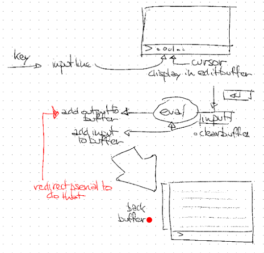

# REPL Window Layout Design

## Design Sketch



## Correct Reading of the Sketch

The sketch is not just a generic terminal split. It shows a **data-flow redesign** for the PicoCalc REPL:

1. **Key input goes into an input line.**
   - The left side says `key → input line`.
   - The input line is displayed in an **edit buffer** on screen.
   - The small upper-right screen sketch shows a prompt/input region, with labels `cursor` and `display in edit buffer`.
   - This means typed characters should be editable before the reader sees them.

2. **The edit buffer owns the visible cursor.**
   - The top display sketch shows the current typed expression, e.g. something like `> ...`, with a cursor annotation.
   - Cursor movement/editing happens locally in the input line editor, not by directly printing terminal characters into the scrolling display.

3. **Enter submits the input.**
   - On the right side, an Enter-key drawing points down into an `input` box.
   - Under it is the note `clear buffer`.
   - Interpretation: pressing Enter commits the current edit buffer as one input line, then clears the input editor.

4. **The submitted input is sent to `eval`.**
   - The `input` box points into the central `eval` bubble.
   - The submitted line becomes the reader/evaluator's input.
   - This keeps the existing REPL shape conceptually intact: read expression, eval expression, print result.

5. **Both input and output are added to the back buffer.**
   - A lower arrow from the input/eval area points left and is labeled `add input to buffer`.
   - An upper arrow from `eval` points left and is labeled `add output to buffer`.
   - This means the back buffer is the persistent transcript: it contains what the user submitted plus what evaluation printed/returned.

6. **`pserial` is redirected to do this.**
   - The red note says `redirect pserial to do that`, pointing toward the `add output to buffer` path.
   - This is the key implementation point: instead of `pserial()` writing characters directly to the TFT terminal, `pserial()` should append characters to the back buffer/transcript.

7. **The back buffer is then displayed as the REPL history.**
   - The bottom-right screen sketch is labeled `back buffer`.
   - It shows multiple prior output lines and a prompt line at the bottom.
   - This is the scrollback/transcript view: render the buffered transcript into the visible display area.

## Intended Architecture

The new REPL window should have two different buffers with different semantics:

### 1. Edit Buffer / Input Line

Mutable, short-lived, user-editable state.

Responsibilities:

- Receive raw key events.
- Insert/delete characters at cursor.
- Move cursor left/right, possibly home/end.
- Render the current prompt and typed text.
- On Enter:
  - copy the current input line to the evaluator input queue,
  - append the submitted line to the back buffer,
  - clear the edit buffer.

This is the replacement for treating every keypress as a terminal character immediately sent through `gserial()`.

### 2. Back Buffer / Transcript Buffer

Append-oriented, persistent session transcript.

Responsibilities:

- Store submitted input lines.
- Store evaluator/printer output.
- Store errors and any text printed via `pserial()`.
- Provide visible scrollback/backscroll.
- Render the current viewport of history to the display.

This is where `pserial()` should write after the remodel.

## Data Flow from the Sketch

```text
raw key
  ↓
input line / edit buffer ── render current input + cursor
  ↓ Enter
committed input line
  ├── append submitted input to back buffer
  ├── feed committed chars to readmain(gserial)
  ↓
eval(expression)
  ↓
printobject(result, pserial)
  ↓
pserial redirected to append output chars to back buffer
  ↓
back buffer viewport rendered to display
```

## Source Mapping

From `docs/ulisp-picocalc-source-index.md`:

| Source area | Current role | Remodel |
|---|---|---|
| §25 Printer / `pserial()` lines 6976+ | Writes directly to serial/display | Redirect to transcript/back buffer append path. |
| §26 Display / `Display()` lines 7263+ | Terminal emulator directly mutating screen grid | Replace or demote into renderer for back buffer + edit buffer. |
| §26 Keyboard / `ProcessKey()` and `gserial()` lines 7393/7464 | Raw key handling and character source for reader | Split raw key handling from committed input delivery. |
| §27 Reader / `readmain(gfun)` lines 7673+ | Reads chars from `gserial()` | Keep API; `gserial()` should return committed edit-buffer chars. |
| §28 REPL / `repl()` lines 7724+ | Calls `readmain(gserial)`, `eval`, `printobject(result, pserial)` | Ideally unchanged except for new initialization/state reset. |

## Implementation Sketch

### Core State

```c
struct EditBuffer {
  char text[INPUT_MAX];
  uint16_t len;
  uint16_t cursor;
  bool committed;
  uint16_t read_pos;   // position consumed by gserial() after Enter
};

struct BackBuffer {
  char lines[BACK_LINES][SCREEN_COLS + 1];
  uint16_t line_count;
  uint16_t head;
  uint16_t current_col;
  uint16_t viewport_top;
};
```

### Key Handling

- Printable key: insert into `EditBuffer.text` at `cursor`.
- Left/right: move `cursor`.
- Backspace/delete: mutate `EditBuffer.text`.
- Enter:
  - append prompt + input text to `BackBuffer`,
  - mark `EditBuffer` as committed,
  - reset `read_pos = 0`,
  - after reader consumes it, clear editor for next input.

### `gserial()` After Remodel

`gserial()` should no longer be a direct raw-key stream. It should:

1. Run the UI/key event pump until an edit buffer is committed.
2. Return committed input characters one by one to `readmain()`.
3. Return newline at the end of the committed input.
4. Clear/reset the edit buffer after the committed line has been consumed.

### `pserial()` After Remodel

`pserial(c)` should:

1. Still write to host serial if needed.
2. Append `c` to the back buffer.
3. Trigger redraw of the back buffer viewport.
4. Never directly mutate the edit buffer.

## Open Design Questions

- Should the input line be visually overlaid at the bottom of the same display, or should the entire screen be redrawn as back buffer plus active edit line?
- Should submitted input be stored with the prompt (`> (+ 1 2)`) or as raw input plus separate prompt metadata?
- Should history recall reuse the back buffer or have a separate input-history ring?
- What is the minimum useful `BACK_LINES` count on RP2040 memory budget?
- How do we represent wrapped long lines: physical screen rows or logical transcript entries?
